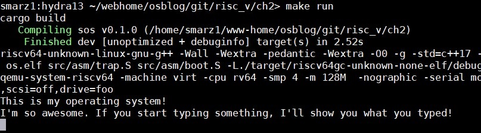
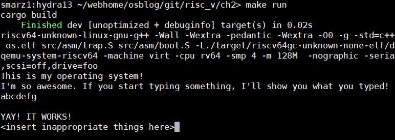
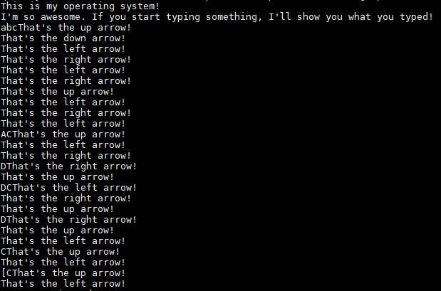

# 通信

这是[用 Rust 编写 RISC-V 操作系统](http://osblog.stephenmarz.com/index.html)系列教程中的第 2 章。

[目录](index.md) → [第 1 章](ch1.md) → 第 2 章 → [第 3.1 章](ch3.1.md)

**<span style='color:red'>2019年10月4日：仅Patreon</span>**

**<span style='color:red'>2019年10月6日：公开</span>**

## 视频

带解说的教学视频可以在以下网站找到:[https://www.youtube.com/watch?v=1SR1sB8W248](https://www.youtube.com/watch?v=1SR1sB8W248)。

## 概述

在什么都显示不出来的情况下，我们编写的这个操作系统有什么优点？简单来说确实没有。但我们已经让这个小家伙诞生了，并给它起了个名字，所以我们要进一步培养它！

我们将开始构建操作系统的各个部分，它们将像拼图一样，在之后组合在一起。有些会在相当早的时候就装配好（控制台和UART驱动有紧密的结合），有些会在以后组装。请耐心看下去，我们最终一定会成功的！

## 获取代码

为了更容易跟上进度，请到[https://github.com/sgmarz/osblog](https://github.com/sgmarz/osblog)获取第二章的代码。

## 通用异步收发传输器（UART）

我们将首先使用UART（通用异步收发传输器）进行通信。我们通过QEMU使用的虚拟机模拟了NS16550A UART芯片组。我们使用内存映射的I/O在地址`0x1000_0000`处控制这个UART系统。在这里，我们可以控制NS16550a的寄存器，它们都是8位的。

## 内存映射I/O（MMIO）

基本上，我们要做的是设置一个指向地址0x1000_0000的指针。当我们写到这个地址或这个地址的某个偏移量时，我们实际上是在与UART设备而不是物理RAM对话。这是一个在嵌入式系统中众所周知的系统，称为MMIO,也即内存映射的输入和输出。

## NS16550a寄存器

寄存器只是位于硬件设备上的一点内存。对于NS16550a来说，这个内存是一个字节一个字节地访问的。例如，在下面的寄存器布局中（见 "寄存器图表 "），你可以看到发送器（THR）和接收器（RBR）寄存器都正好是8位（1字节）。当我从指向0x1000_0000的指针读取时，我从RBR中提取这8位。当我写到指向0x1000_0000的完全相同的指针时，我将会向THR发送。

这个MMIO系统很好，因为它不需要我们做除了从内存地址读写之外的任何特别的事情。由于Rust支持裸指针，它使我们能够相当容易地控制硬件。在C++中，我们可以编写下面的内容来读写传输器。

```c
void mmio_write(unsigned long address, int offset, char value)
{
    // We use volatile so that the optimizer on the
    // compiler doesn't think we're writing a value for
    // no reason.
    volatile char *reg = (char *)address;

    // To write, the pointer is on the left hand side of
    // the assignment operator.
    // Transmit the word 'A'
    // (which is the 8-bit value 65 or 0b0100_0001)
    *(reg + offset) = value;
}

char mmio_read(unsigned long address, int offset)
{
    // We use volatile so that the optimizer on the
    // compiler doesn't think we're writing a value for
    // no reason.
    volatile char *reg = (char *)address;

    // To read, the pointer is dereferenced on a read.
    // This reads from the receiver and returns the data.
    return *(reg + offset);
}
```

## Rust的MMIO

Rust确实有裸指针，但它没有volatile关键字。我们将指针作为对象使用，并使用Rust裸指针的`write_volatile`和`read_volatile`成员函数。比如说：

```rust
/// # Safety
///
/// We label the mmio function unsafe since
/// we will be working with raw memory. Rust cannot
/// make any guarantees when we do this.
fn unsafe mmio_write(address: usize, offset: usize, value: u8) {
    // Set the pointer based off of the address
    let reg = address as *mut u8;

    // write_volatile is a member of the *mut raw
    // and we can use the .add() to give us another pointer
    // at an offset based on the original pointer's memory
    // address. NOTE: The add uses pointer arithmetic so it is
    // new_pointer = old_pointer + sizeof(pointer_type) * offset
    reg.add(offset).write_volatile(value);
}

/// # Safety
///
/// We label the mmio function unsafe since
/// we will be working with raw memory. Rust cannot
/// make any guarantees when we do this.
fn unsafe mmio_read(address: usize, offset: usize, value: u8) -> u8 {
    // Set the pointer based off of the address
    let reg = address as *mut u8;

    // read_volatile() is much like write_volatile() except it
    // will grab 8-bits from the pointer and give that value to us.
    // We don't add a semi-colon at the end here so that the value
    // is "returned".
    reg.add(offset).read_volatile()
}
```

如果你对add感到奇怪，它是Rust对普通的`ptr.offset`方法的一个封装，但是offset的参数是`isize`，意味着它可以是正的或负的。为了清楚起见，我使用了基础寄存器的`.add()`，但你可以选择你想用的那种。

我在`mmio_read`的注释中提到了不加分号的问题。Rust*主要是*一种 "表达式语言"，正如这里所讲的:[https://doc.rust-lang.org/reference/statements-and-expressions.html](https://doc.rust-lang.org/reference/statements-and-expressions.html)。本质上，Rust会将函数归结为返回值，对于这个函数来说，返回部分是一个u8（无符号8位整数）。当我们加上分号时，我们告诉Rust放弃求值的结果，并返回（）类型，Rust称之为*单元*类型（[见https://doc.rust-lang.org/stable/rust-by-example/expression.html](https://doc.rust-lang.org/stable/rust-by-example/expression.html)）。

## 寄存器图表

NS16550a的寄存器如下：


这个寄存器图的重要部分是，发送器和接收器都在0x1000_0000。当我们向这个地址写8位时，它把这个字符放到发送器中。当我们从这个地址读出8位时，它从接收器中送出一个字符。

 在我们发送和接收之前，我们必须对UART控制器进行如下设置。

- 设置字长为8位（LCR[1:0]）。
- 启用FIFO（FCR[0]）。
- 启用接收器中断（IER[0]）。

## 设置字长为8位

字长描述了发送器和接收器的缓冲区一次可以包含多少位。之所以可以设置，是因为即使我们可以同时支持8位，但另一边的UART可能无法支持。然而，QEMU是支持8位的，所以设为8位就是我们要做的。在线路控制寄存器（LCR）中，有两位用来控制字长。根据规范，如果我们在这两个位上各写一个1，我们就会得到一个8位的字符长度。默认情况下，如果我们在每个位中写0，我们得到会是一个5位的字长，这有点奇怪。

## 启用FIFO

FIFO通常被实现为一个硬件移位寄存器，允许一次存储多个字节。FIFO是先入先出(First-In, First-Out)的缩写。当数据被添加到FIFO中时，它的顺序不变，所以当我从同一个FIFO中读取时，我得到的是第一条输入的数据。这很不错，因为当有人输入 "hello "时，我们一次读出一个字节，可以按序得到h、e、l、l、o。

## 启用接收器中断

启用接收器中断意味着每当数据被添加到接收器中时，CPU就会通过中断得到通知。在本章中，我们将不实际处理中断，因为这需要我们对平台级中断控制器（PLIC）进行编程，我们将在后面进行。相反，在本章中，我们将对UART进行 "轮询"，看数据何时到达。

## 设置信号传输率（BAUD）

由于这不是一个真正的UART（只是模拟的），我们实际上不需要设置分频数来划分时钟以确定一个特定的波特率。我们的做法是是将DLAB（除数锁存器访问位）设置为1。然后基址+0和基址+1现在分别是除数的下8位和上8位。然后，通过将DLAB位清除为0来关闭锁存器。

```rust
/// Initialize the UART driver by setting
/// the word length, FIFOs, and interrupts
pub fn uart_init(base_addr: usize) {
    let ptr = base_addr as *mut u8;
    unsafe {
        // First, set the word length, which
        // are bits 0, and 1 of the line control register (LCR)
        // which is at base_address + 3
        // We can easily write the value 3 here or 0b11, but I'm
        // extending it so that it is clear we're setting two individual
        // fields
        //         Word 0     Word 1
        //         ~~~~~~     ~~~~~~
        let lcr = (1 << 0) | (1 << 1);
        ptr.add(3).write_volatile(lcr);

        // Now, enable the FIFO, which is bit index 0 of the FIFO
        // control register (FCR at offset 2).
        // Again, we can just write 1 here, but when we use left shift,
        // it's easier to see that we're trying to write bit index #0.
        ptr.add(2).write_volatile(1 << 0);

        // Enable receiver buffer interrupts, which is at bit index
        // 0 of the interrupt enable register (IER at offset 1).
        ptr.add(1).write_volatile(1 << 0);

        // If we cared about the divisor, the code below would set the divisor
        // from a global clock rate of 22.729 MHz (22,729,000 cycles per second)
        // to a signaling rate of 2400 (BAUD). We usually have much faster signalling
        // rates nowadays, but this demonstrates what the divisor actually does.
        // The formula given in the NS16500A specification for calculating the divisor
        // is:
        // divisor = ceil( (clock_hz) / (baud_sps x 16) )
        // So, we substitute our values and get:
        // divisor = ceil( 22_729_000 / (2400 x 16) )
        // divisor = ceil( 22_729_000 / 38_400 )
        // divisor = ceil( 591.901 ) = 592

        // The divisor register is two bytes (16 bits), so we need to split the value
        // 592 into two bytes. Typically, we would calculate this based on measuring
        // the clock rate, but again, for our purposes [qemu], this doesn't really do
        // anything.
        let divisor: u16 = 592;
        let divisor_least: u8 = divisor & 0xff;
        let divisor_most:  u8 = divisor >> 8;

        // Notice that the divisor register DLL (divisor latch least) and DLM (divisor
        // latch most) have the same base address as the receiver/transmitter and the
        // interrupt enable register. To change what the base address points to, we
        // open the "divisor latch" by writing 1 into the Divisor Latch Access Bit
        // (DLAB), which is bit index 7 of the Line Control Register (LCR) which
        // is at base_address + 3.
        ptr.add(3).write_volatile(lcr | 1 << 7);

        // Now, base addresses 0 and 1 point to DLL and DLM, respectively.
        // Put the lower 8 bits of the divisor into DLL
        ptr.add(0).write_volatile(divisor_least);
        ptr.add(1).write_volatile(divisor_most);

        // Now that we've written the divisor, we never have to touch this again. In
        // hardware, this will divide the global clock (22.729 MHz) into one suitable
        // for 2,400 signals per second. So, to once again get access to the
        // RBR/THR/IER registers, we need to close the DLAB bit by clearing it to 0.
        ptr.add(3).write_volatile(lcr);
    }
}
```

首先，你可能会注意到，函数本身不再是`不安全(unsafe)`的了。相反，函数主体的各个部分是`不安全`的。当我们写一个不安全块时，我们是在告诉Rust "拿着我的啤酒(我要做些危险的事了)"。如果函数被标记为不安全，比如`unsafe fn uart_init`，那么函数主体中的所有代码都可以是安全或不安全的。当我们给单个不安全块贴上标签时，只有在我们无法避免的情况下，我们才会进入不安全的Rust。

## 读取UART

现在我们已经初始化了，现在只要有字符出现，我们就可以从UART读取。在之后的部分中这种读取将由一个中断触发，我们可以读取数值并将其存入RAM中的一个缓冲区。

```rust
fn uart_get(base_addr: usize) -> Option {
        let ptr = base_addr as *mut u8;
        unsafe {
            // Bit index #5 is the Line Control Register.
            if ptr.add(5).read_volatile() & 1 == 0 {
                // The DR bit is 0, meaning no data
                None
            }
            else {
                // The DR bit is 1, meaning data!
                Some(ptr.add(0).read_volatile())
            }
        }
    }
```

## 写入UART

同样地，我们也希望能够写入控制台。因此，让我们编写uart_write。

```rust
fn uart_put(base_addr: usize, c: u8) {
    let ptr = base_addr as *mut u8;
    unsafe {
        // If we get here, the transmitter is empty, so transmit
        // our stuff!
        ptr.add(0).write_volatile(c);
    }
}
```

## 加入到Rust主程序

现在我们已经写好了uart函数，让我们创建一个uart模块。首先创建一个名为` src/uart.rs `的文件。然后将uart_init、uart_get和uart_put函数移入其中。我们将使用名为Rust "trait "的东西，这样我们就可以将我们的UART与任何想要写的东西联系起来......主要是`>write！`宏。

与C++不同，Rust的唯一结构性容器是struct。Rust的struct可以有方法和成员变量，就像C++一样。所以，我们要把Uart驱动包装成一个名为Uart的结构。

```rust
pub struct Uart {
    base_address: usize,
}
```

我们正在存储UART的基地址。有一些平台有多个UART!然而，现在我们要把它与`core::fmt::Write` trait联系起来。这使我们可以使用已经内置在Rust中的宏`write!`。要实现一个trait，我们需要使用` impl Write for Uart `语法，同时确保我们使用`core::fmt::Write`，以便将trait导入我们的uart.rs文件中。这个trait能确保某个（或某些）函数会存在。例如，下面的 `write_str` 是由 trait `Write` 要求的。这些行为非常像Java的`interfaces`或C++的`abstract`类。

```rust
// Rust allows us to import multiple traits or structures or other namespaces in one line by
// using the braces { } as I've done here:
use core::fmt::{Error, Write};

// This is the memory load of the structure. Unlike C++, we don't define the member functions
// here. Instead, we'll use an impl block (implements or implementation).
pub struct Uart {
    base_address: usize,
}
// Here's the implementation block. Notice that impl Uart simply implements member functions
// in our already defined structure.
impl Uart {
    pub fn new(base_address: usize) -> Self {
        Uart {
            // Since our parameter is also named the same as the member
            // variable, we can just label it by name.
            base_address
        }
    }
}
// This is a slightly different syntax. Write is this "trait", meaning it is much like
// an interface where we're just guaranteeing a certain function signature. In the Write
// trait, one is absolutely required to be implemented, which is write_str. There are other
// functions, but they all rely on write_str(), so their default implementation is OK for now.
impl Write for Uart {
    // The trait Write expects us to write the function write_str
    // which looks like:
    fn write_str(&mut self, s: &str) -> Result<(), Error> {
        for c in s.bytes() {
            self.put(c);
        }
        // Return that we succeeded.
        Ok(())
    }
}
```

## 我们来写println!

println!()通常与stdout对接，但由于我们在写操作系统，我们没有这些花哨的功能。所以，我们要自己写。我们将用Rust的元编程语言来写，以代码`macro_rules`开始。这种编程风格是我的第一个难点，很难找到一个好的方法来向本科生讲清楚这种元编程的复杂性，它本身就很像一种语言。

为了确保我们有一个全局宏，我把println写在lib.rs中，我把它称为 "主 "文件。也就是说，我们为操作系统编写的所有模块，如UART、调度、进程，都将是通过lib.rs文件连接的子模块。全局宏放在lib.rs的顶部，用以下代码启动：

```rust
// ///////////////////////////////////
// / RUST MACROS
// ///////////////////////////////////
#[macro_export]
macro_rules! print
{
    ($($args:tt)+) => ({
            use core::fmt::Write;
            let _ = write!(crate::uart::UartDriver::new(0x1000_0000), $($args)+);
    });
}
#[macro_export]
macro_rules! println
{
    () => ({
        print!("\r\n")
    });
    ($fmt:expr) => ({
        print!(concat!($fmt, "\r\n"))
    });
    ($fmt:expr, $($args:tt)+) => ({
        print!(concat!($fmt, "\r\n"), $($args)+)
    });
}
```

在这段代码中，我同时指定了print和println，当我们使用它们的时候，<u>它们将逐渐拥有自己的感叹号</u>。println！所做的就是在我们要打印的东西的末尾添加一个换行。

那么，让我们来看看这个语法。我们通过指定`#[macro_export]`将我们的宏导出到其他的子模块中。这是位于阳面的`#[macro_use]`指令的阴面，它告诉Rust，我们将使用一个crate（库）的宏。

现在，我们进入 "手臂(arms)"，也就是等号-大于号，在C#等语言中也被称为 "胖箭头"。但是正如我自己也在和腰带的尺寸作斗争，我将坚持使用 "手臂 "这一称呼。在这里，我们要指定一个匹配模式。每当我们写下`println!("Hello")`这样的东西时，Rust就会尝试匹配我们指定的参数。所以，我使用美元符号"$"来指定一个元变量。在这里，我们告诉Rust，我们要把我们的参数标记为 "令牌树(token tree)"（tt）参数，这就是`$args:tt`的来源。加号'+'告诉Rust这里可能有一个或多个匹配，所以要想编译，必须至少指定这些标记树参数中的一个，否则会产生错误。

然后我们来到了手臂'=>'。在这里，我们要告诉Rust，如果我们匹配了这个臂膀，需要 "编程 执行"什么。在这里，注意我通过简单地添加大括号{}创建了一个代码域。由于我们的UART驱动实现了`Write` trait，我们必须告诉Rust在调用 "write!"时要 "使用 "该trait。幸运的是，`write！`的功能已经为我们写好了！（感谢Rust开发者!）

Rust尽力成为一个好管家，告诉我们`write!`会返回一些东西。我们用 `let_` 来告诉Rust，我们知道这一点，但我们并不关心。下划线'_'本质上是承认了返回，但还是要抛弃它的值。在`write!`里面，我指定了一个长的路径来获取我们的uart驱动`crate::uart::UartDriver`。基本上，crate指定了根，从那里我们添加了一个名为uart的模块（见下面的代码），在该模块中，我们有一个名为`UartDriver`的结构，它实现了一个名为`new`的静态函数。

最后，我们要告诉Rust将每个参数扩展到`write!`宏的末尾，这样所有的参数（记住：一个或多个）都直接传递给write宏。

对于println，我使用了expr，意思是 "表达式"，以表明这个只是上一个的更严格版本。这篇博客并不打算成为一个编译器教程，所以我打算把它作为 "未来 "的工作来做——欢迎来到学术界！而现在我只想告诉你，Rust会努力地匹配我们给println和print编写的内容。

## 为什么println有3个分支？

与print不同，我们希望能够调用`println!();`来只打印一个换行符。如果我们对`print!`这样做，那就太愚蠢了，因为它什么都不会做。这就是为什么在print中，我们指定了加号'+'，这样我们就可以匹配一个或多个参数。为了匹配零个或多个，我们会使用星号'*'。

第二个手臂是`$fmt:expr`，如果我们提供至少一个参数，Rust就会匹配。在本例中，这是一个格式化字符串--类似于 `"Hello {}"`。请注意，Rust使用了许多C#的风格（或者C#使用了Rust的风格--你们自己争论吧！），而不是C风格的`%d、%s`等。关于格式化的整个讨论可以在这里找到:[https://doc.rust-lang.org/std/fmt/index.html](https://doc.rust-lang.org/std/fmt/index.html)。

第三个手臂将格式化字符串和需要被填充到格式化字符串中的参数结合起来。

## 为什么每次都要创建一个新的UartDriver？

这篇文章已经变得相当长了。我们将使用 "单例 "模式，这样外面就只有一个UartDriver存在。然而，由于内存位置不会变化，我在这里的方法是简单地将该内存地址包裹到一个`UartDriver`结构中。剩下太长了，不再看了，总之我们会成功的!

## 将UART加载到lib.rs中

我使用我的lib.rs作为我的 "守护者（keeper）"。它包含了一些代码，但它的工作是导入其他模块，并给我们一个路径来获取它们，就像我们在print宏中写的`crate::uart::UartDriver`一样。Rust不使用include预处理指令，比如C++的`#include`，而是让我们通过指定`mod uart`来导入模块。我在我的模块前面加了`pub`，使它们成为公共模块。这很像Rust将所有变量默认为不可变的。可见性也是如此，利用`pub`关键字使一个本来是私有的模块变成公共的。

所以，现在我们的代码看起来是这样的：

```rust
#![no_std]
#![feature(panic_info_message,asm)]

// ///////////////////////////////////
// / RUST MACROS
// ///////////////////////////////////
#[macro_export]
macro_rules! print
{
    ($($args:tt)+) => ({
            use core::fmt::Write;
            let _ = write!(crate::uart::UartDriver::new(0x1000_0000), $($args)+);
    });
}
#[macro_export]
macro_rules! println
{
    () => ({
        print!("\r\n")
    });
    ($fmt:expr) => ({
        print!(concat!($fmt, "\r\n"))
    });
    ($fmt:expr, $($args:tt)+) => ({
        print!(concat!($fmt, "\r\n"), $($args)+)
    });
}

// ///////////////////////////////////
// / LANGUAGE STRUCTURES / FUNCTIONS
// ///////////////////////////////////
#[no_mangle]
extern "C" fn eh_personality() {}
#[panic_handler]
fn panic(info: &core::panic::PanicInfo) -> ! {
    print!("Aborting: ");
    if let Some(p) = info.location() {
        println!(
                    "line {}, file {}: {}",
                    p.line(),
                    p.file(),
                    info.message().unwrap()
        );
    }
    else {
        println!("no information available.");
    }
    abort();
}
#[no_mangle]
extern "C"
fn abort() -> ! {
    loop {
        unsafe {
            asm!("wfi"::::"volatile");
        }
    }
}

// ///////////////////////////////////
// / ENTRY POINT
// ///////////////////////////////////
#[no_mangle]
extern "C"
fn kmain() {
    // I don't need to add crate in front here because we're in the root
    // module (lib.rs).
    // However, we had to add crate:: for the print! macro since that metaprogrammed
    // macro will expand into other, non root modules, where the crate:: will be
    // necessary.
    // Remember, the default base address is 0x1000_0000.

    let mut my_uart = uart::UartDriver::new(0x1000_0000);
    my_uart.init();

    println!("This is my operating system!");
    println!("I'm so awesome. If you start typing something, I'll show you what you typed!");

    // Our goal is to repeat, or echo, what the user types to us. This is just for testing!
}

// ///////////////////////////////////
// / RUST MODULES
// ///////////////////////////////////

pub mod uart;
```

我继续下一步，并预设了println!()（去<在此插入你的团队名称>），期望一切都能顺利。在我的人生中总会有那么一刻，当我开始`make`时，我屏住呼吸，只等着一连串的错误来告诉我我是一个多么糟糕的程序员。

有了这个，`pub mod uart`将在与lib.rs相同的目录下寻找一个叫uart.rs的文件。稍后，我们将创建目录并使用`mod.rs`。如果你知道我在说什么，我们很快就能达到目的了!如果你不知道，别担心，我们以后总会到终点的。(是的，我说了两件相互矛盾的事情）。

由于这种导入是Rust的行为，而且我们写了`uart.rs`，我们应该保持着积极状态。

## 说出来，我的小家伙

让我们看看是否能让我们的孩子（操作系统）对我们说话。假设我们正确地写了`write_str`，而且我们没有忘记先初始化UART，我们应该看到一些显示。我一开始忘了，但我可以编辑我的帖子--谁能发现呢，对吧？



所以，运行`make run`，让小家伙说话吧!如果你什么都得不到，请看一下我的第二章的Git 仓库，网址是：[https://github.com/sgmarz/osblog](https://github.com/sgmarz/osblog)。

## 认真听，我的小家伙

现在我们知道我们的孩子可以说话，让我们看看它是否可以听见。请记住，`write_str`作为Write trait的一部分，调用我们的`uart_put`函数来逐个字符（严格地说，逐个u8）填入。自从UTF以来，字符（character）已经越来越没落了。

我们最终会把这段代码移到带有缓冲区的控制台处理程序中，这样我们就可以获取整个字符串，而不仅仅是字符，但这里暂时还没这么高级：

```rust
let mut my_uart = uart::UartDriver::new(0x1000_0000);
my_uart.init();

println!("This is my operating system!");
println!("I'm so awesome. If you start typing something, I'll show you what you typed!");

// Now see if we can read stuff:
// Usually we can use #[test] modules in Rust, but it would convolute the
// task at hand. So, we'll just add testing snippets.
loop {
    if let Some(c) = my_uart.get() {
        match c {
            8 => {
                // This is a backspace, so we essentially have
                // to write a space and backup again:
                print!("{}{}{}", 8 as char, ' ', 8 as char);
            },
            10 | 13 => {
                // Newline or carriage-return
                println!();
            },
            _ => {
                print!("{}", c as char);
            }
        }
    }
}
```

Rust有一个`循环(loop)`，它无条件地以最快的速度进行循环。我们应该加一些break，但现在让我们以最快的速度读取字符。大多数非Rust程序员首先会看到的新语法是`if let Some(c)`。记住`my_uart.get()`返回一个Option，它要么是`Some`，要么是`None`。

使用 `if let`，我们可以从option中获取准确值，并同时查看`Option`是否为 `Some` 。在上面的例子中，`if let`只在`my_uart.get()`返回`Some`时执行其主体。请记住，我们还将从UART中取出的字符包装到这个Some()结构中（确切地说，是枚举）。因此，这个块里面的代码意味着一个叫做c的新变量获得了被`Some`包装的字符。很好，对吗？

第二个语言结构是`匹配(match)`语句。它类似于`switch`语句，但没有许多不清不楚的break。在这种情况下，Rust将检查变量c的内容，然后我们指定某些情况来检查c是否与之匹配。在上面的代码中，我们设定当c匹配8和10或13时会执行特定的代码。|（管道字符）允许我们为一个手臂指定多个情况。同样，就像print和println中的宏匹配一样，我们使用胖箭头来扩展手臂。

Case 8是退格的数字代码。然而，退格的真正含义是 "将光标向左移动一个字符"。所以，如果我们只是单纯的print，光标会移动，但那一格的文本仍然在那里。因此，我们的解决方案是移动光标，画一个空格（这将使光标向右移动一个空格），然后再将光标向左移动一个空格。

Case 10是'\n'（换行）字符，Case13是'\r'（回车）字符。根据你的终端和终端仿真器，你可能只有一个或另一个或两者都有。我们所做的就是调用`println!()`，这将使Rust匹配第一个臂（没有任何表达式或token树的那个）。回顾那里的代码，我们看到这将只是打印一个换行。

```rust
// This is println!s arm if no parameters are specified.
() => ({
    print!("\r\n")
});
```

最后，下划线被用来包括其他所有的东西--有点像 "非上述 "选项。它很像switch语句的`默认(default`)情况。任何我们不能用上面的手臂匹配的东西都可以在这里匹配。Rust强迫我们为每一种可能性都准备一个case，因此，我们要么指定256种可能性（0-255），要么指定几种可能性，然后再指定一个万能的。我选择了后者。

附注：如果只有一行代码，Rust并不要求我们为每个匹配臂添加括号。然而，由于我们将在这段代码的基础上进行开发，我为 "未来的扩展 "加上了大括号。

## 测试！

让我们看看这是否有效。



## 最后的控制台操作

许多人不记得ANSI转义序列了，因为我们现在有GUI。然而，每当你按下扩展键，如方向键时，这些将被传递给你的UART系统。现在，方向键只是在屏幕上移动光标，因为我们只是打印出准确的可见字符。

ANSI转义序列是多个字节，以字节0x1b（十进制27）开始。下一个字节是0x5b（十进制91），是左括号字符'['。然后剩下的是序列的参数。我们要捕捉上、下、左、右箭头的序列。所以，在你的匹配手臂上添加以下内容。

```rust
0x1b => {
    // Those familiar with ANSI escape sequences
    // knows that this is one of them. The next
    // thing we should get is the left bracket [
    // These are multi-byte sequences, so we can take
    // a chance and get from UART ourselves.
    // Later, we'll button this up.
    if Some(next_byte) = my_uart.get() {
        if next_byte == 91 {
            // This is a right bracket! We're on our way!
            if let Some(b) = my_uart.get() {
                match b as char {
                    'A' => {
                        println!("That's the up arrow!");
                    },
                    'B' => {
                        println!("That's the down arrow!");
                    },
                    'C' => {
                        println!("That's the right arrow!");
                    },
                    'D' => {
                        println!("That's the left arrow!");
                    },
                    _ => {
                        println!("That's something else.....");
                    }
                }
            }
        }
    }
},
```

现在，再次运行你的操作系统，但这一次试试方向箭头！这将有助于我们编写我们的shell。


如果你打箭头太快，有时你会看到A、B、C或D出现。这是因为你会匹配转义序列，但错过了字节91。因此，你的循环看起来只是一个普通的A、B、C或D，甚至是左括号'['。

 

## 哇，这个代码好凌乱

确实。你见过房子的施工吗？你现在看到的是我们在操作系统中铺设的脚手架。这种简单但有点肮脏的通信方式使我们能够聚合我们即将为操作系统的下一个部分建立的代码。这样做的好处是我们可以用很少的代码进行通信。当我们把更多的Rust语言结构放在UART驱动周围时，每个操作可能看起来就不那么明显了。

现在，我们只是想进行通信。我们从牙牙学语开始，然后可以开始将UART集成到一个控制台模块中，该模块将支持更多类似终端的功能。记住，让它能够顺利地工作、玩耍、欢呼、畅饮（beer是一个动词，对吗？），然后我们就可以开始重构代码了。我预计还有很多章节会是这样的。我们将探索已经被广泛研究的内存分配器，挑选一个版本，看看它是否适合我们，如果不适合，再挑选另一个。我认为这更像是一段旅程，而不是单纯的"这是最后成果，享受吧！"这种只重视结果的工作。已经有一个完成的作品了--如果这是你唯一的目标的话，那就是[RISC-V的Linux](https://fedoraproject.org/wiki/Architectures/RISC-V)。

## 通信是关键

使用debug程序是一个很大的挑战，尤其是当你不熟悉如何使用一般的调试器甚至某个特殊的调试器时。相反，我教导我的那些没有编程经验的学生每次都多打印出一些值，看看是否能显示出他们认为应该得到的东西。你现在可以与你的操作系统进行听说交流。你可以开始自己做些小实验，看看你能让它做什么很酷的事情，同时研究一下Rust的使用。我并不是一个专家，正如许多Rust开发者在我的GitHub上所证明的那样--尽管我很欢迎指导（我真的很欢迎！）。所以，也许你能找到比我的写法更整洁、更好的方法来编写Rust。如果是这样，请告诉我们！

[第 1 章](ch1.md) → 第 2 章 → [第 3.1 章](ch3.1.md)
